# Unity3D Integration

[1. Introduction](#1) <br>
[2. Request account and app id](#2)<br>
[3. Import the SDK](#3)<br>
[4. Initialize the SDK](#4)<br>
[5. Integrate Native Ad](#5)<br>
[6. Integrate Rewarded Video Ad](#6)<br>
[7. Integrate Interstitial Ad](#7)<br>
[8. Integrate Banner Ad](#8)<br>
[9. On Splash Ad](#9)<br>

<h2 id='1'> 1. Introduction </h2>

This document describes how to integrate the TopOn unity3d SDK from the account application to SDK integration. Following the workflow, you can integrate the TopOn SDK successfully. TopOn supports ad forms as follows in Unity 3D platform:

| Ads Form | Introduction |
| ---- | ---- |
| Native | Native Ads only provides the Ads data without UI. |
| Video | Video Ads, with UI |
| Interstitial | Interstitial Ads，with UI |
| Banner | Banner Ads，with UI |

You can choose the appropriate Ads forms of advertising according to your App's demands, the specific integration method see the following description.

<h2 id='2'>2. Request account and app id</h2>

Refer to <a href="https://app.toponad.com/document/doc-en/getstarted/get_started.html" target="_blank">Get Started</a> for Account Registration and Login Instructions

<h2 id='3'> 3. Import  the SDK</h2>

### 3.1 SDK Package Contents

**AnyThinkSDK**'s package contains the following contents:

| File Name | Description | Necessary |
| ---- | ---- | ---- |
| anythinkunity3d.unitypackage | **AnyThink** Unity3d Plugin package, you can import this package into the unity3d project for integration | Yes |

**Note: Use Unity3D 2018 or newer for compatibility.**

#### 3.1.1 Android import introduction（Introduction for Path：/Assets/Plugins/Android ）

**1.libs plugin introduction**

| Path | Description | Necessary|
|----|----|----|
|./libs/aars\_anythink| Core SDK of TopOn|Yes|
|./libs/aars\_china\_network | Network SDK of China| No|
|./libs/aars/aar\_international\_network | Network SDK of Non-China| No |
|./libs/aars/aar\_v4 | Android Support v4+v7（No adding packaging if it existed in project）| Yes|

**The SDK folder in China and the SDK folder in non-China zone can only be selected for packaging（Select access based on the traffic of the developer application）**

**（1）./libs/aars\_china\_network：**

| Path | Description | Necessary|
|----|----|----|
|./aars\_china\_network/aars\_plugin| SDK Plugins of China（No adding packaging if it existed in project）|Yes|
|./aars\_china\_network/aar\_toutiao | **穿山甲**SDK| No|
|./aars\_china\_network/aar\_baidu | **百度**SDK| No |
|./aars\_china\_network/aar\_gdt | **广点通**SDK| No |
|./aars\_china\_network/aar\_ks | **快手**SDK| No |
|./aars\_china\_network/aar\_ksyun | **金山云**SDK| No |
|./aars\_china\_network/aar\_luomi | **洛米**SDK| No |
|./aars\_china\_network/aar\_mintegral_china | **Mintegral（China）**SDK| 否|
|./aars\_china\_network/aar\_oneway | **Oneway**SDK| No |
|./aars\_china\_network/aar\_sigmob | **Sigmob**SDK| No |
|./aars\_china\_network/aar\_uniplay | **玩转互联**SDK| No |

**（2）./libs/aars\_international\_network：**

| Path | Description | Necessary|
|----|----|----|
|./aars\_international\_network/aars\_plugin| SDK Plugins of Non-China（No adding packaging if it existed in project）|Yes|
|./aars\_international\_network/aars\_gms\_service | Google Service SDK（No adding packaging if it existed in project）| Yes|
|./aars\_international\_network/aar\_admob | **Admob** SDK| No|
|./aars\_international\_network/aar\_facebook | **Facebook** SDK| No|
|./aars\_international\_network/aar\_adcolony | **Adcolony** SDK| No|
|./aars\_international\_network/aar\_applovin | **Applovin** SDK| No |
|./aars\_international\_network/aar\_appnext | **Appnext** SDK| No |
|./aars\_international\_network/aar\_chartboost | **Chartboost** SDK| No |
|./aars\_international\_network/aar\_flurry | **Flurry** SDK| No |
|./aars\_international\_network/aar\_inmobi | **Inmobi** SDK| No |
|./aars\_international\_network/aar\_ironsource | **Ironsource** SDK| No |
|./aars\_international\_network/aar\_maio | **Maio** SDK| No |
|./aars\_international\_network/aar\_mintegral\_international | **Mintegral（Non-china）** SDK| No |
|./aars\_international\_network/aar\_mopub | **Mopub** SDK| No |
|./aars\_international\_network/aar\_nend | **Nend** SDK| No |
|./aars\_international\_network/aar\_startapp | **StartApp** SDK| No |
|./aars\_international\_network/aar\_superawesome | **SuperAwesome** SDK| No |
|./aars\_international\_network/aar\_tapjoy | **Tapjoy** SDK| No |
|./aars\_international\_network/aar\_unityads | **UnityAds** SDK| No |
|./aars\_international\_network/aar\_vungle | **Vungle** SDK| No |


**2.mainTemplate.gradle introduction** <br>
You must first use Unity3d to generate the mainTemplate.gradle file. As shown below：

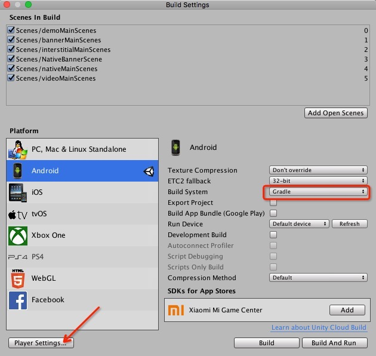

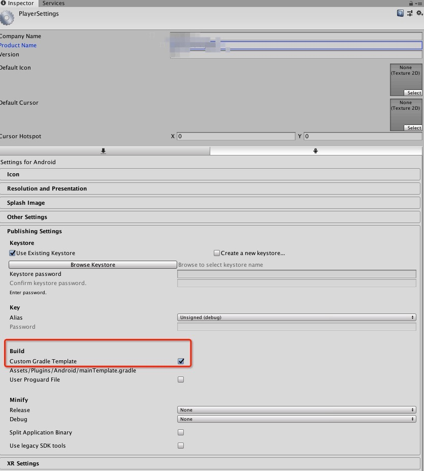


Description for mainTemplate.gradle：
**(The generated sample files are provided in the SDK. Since the gradle files generated by different versions of the Unity3d tools will be different, the developer needs to delete and regenerate the gradle files under the Unity3d tool. The SDK is for reference only.)**

```java
buildscript {
    repositories {
        google()
        jcenter()
    }

    dependencies {
    	  //Different Unity3d tools may generate different version numbers.
        classpath 'com.android.tools.build:gradle:3.2.0'
**BUILD_SCRIPT_DEPS**}
}

...

android {
    compileSdkVersion **APIVERSION**
    buildToolsVersion '**BUILDTOOLS**'

    compileOptions {
        sourceCompatibility JavaVersion.VERSION_1_8
        targetCompatibility JavaVersion.VERSION_1_8
    }

    defaultConfig {
        minSdkVersion **MINSDKVERSION**
        targetSdkVersion **TARGETSDKVERSION**
        applicationId '**APPLICATIONID**'
        ndk {
            abiFilters **ABIFILTERS**
        }
        versionCode **VERSIONCODE**
        versionName '**VERSIONNAME**'
        multiDexEnabled true //Additional settings are required to set when the number of lines of code exceeds 64k.
    }
	.....
    
}


```

**3.AndroidManifest.xml introduction**：

```java
<?xml version="1.0" encoding="utf-8"?>
<manifest xmlns:android="http://schemas.android.com/apk/res/android"
xmlns:tools="http://schemas.android.com/tools"
package="com.superapp.filemanager"
android:versionCode="2"
android:versionName="1.1" >

<uses-sdk
android:minSdkVersion="16"
android:targetSdkVersion="28"
android:usesCleartextTraffic="true" />

<!--The configuration of usesCleartextTraffic is required. The main role is to make http requests available in the game (must be used)-->
<application
android:usesCleartextTraffic="true"
>


<activity android:name="com.unity3d.player.UnityPlayerActivity" android:label="@string/app_name">
<intent-filter>
<action android:name="android.intent.action.MAIN" />
<category android:name="android.intent.category.LAUNCHER" />
</intent-filter>
<meta-data android:name="unityplayer.UnityActivity" android:value="true" />
</activity>

<!--This setting is mainly for adapting to machines above 9.0 (must be used)-->
<uses-library android:name="org.apache.http.legacy" android:required="false"/>
</application>


<!--Must have permission-->
<uses-permission android:name="android.permission.INTERNET" />
<uses-permission android:name="android.permission.ACCESS_NETWORK_STATE" />


</manifest>

```

**4.Instructions for merging with other third-party Android SDKs** <br>
（1）The third-party jar and aar package must be placed in the following directory：/Assets/Plugins/Android/libs/<br>
（2）If the third-party sdk has resources, put the resource folder in the directory：/Assets/Plugins/Android/<br>
（3）If the third party has an AndroidManifest file, you need to merge it with the /Assets/Plugins/Android/AndroidManifest.xml file，Topon needs to retain the necessary parts of the above instructions.


**5.How to choose part of Android AAR or Jar is not packaged**

**Example for No packaging the Network of China ：**<br>

**Step 1：**Select a directory that shows the presentation files in Unity3d<br>
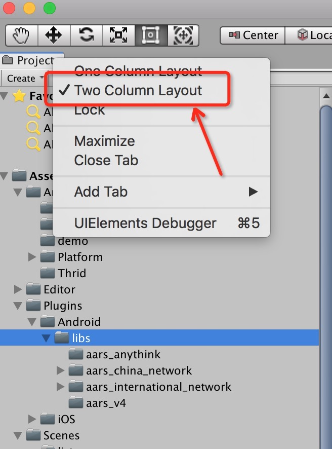 <br>

**Step 2：**Select all the SDK folders in China, select all the aar packages and jar packages in the next row, and then select the platform on the far right.<br>
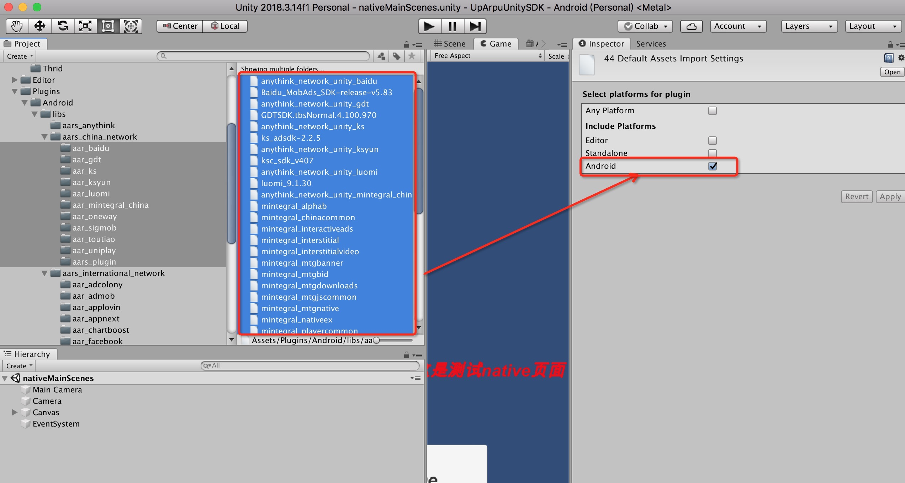<br>

**Step 3：**Remove the packaging options of the Android platform, and then select Apply to complete the culling package operation.
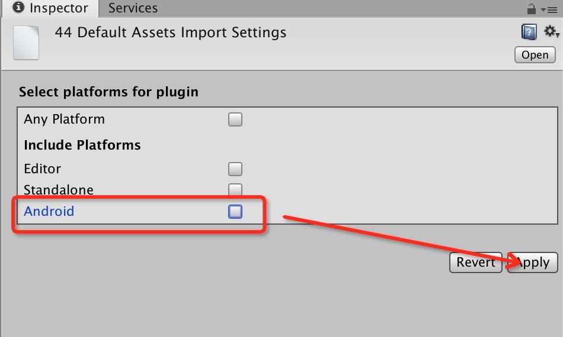<br>


#### 3.1.2 iOS import introduction

After compiling the Xcode project with Unity, open the Xcode project, import the required SDK according to the guidelines of each third-party platform and link the system framework and lib that it depends on. You can also see the help of each platform of Topon <a href="https://app.toponad.com/document/doc-en/ios/topon_sdk_iOS_access_guide_english_core.html" target="_blank">Networks SDK Access Help for Topon</a>

All third-party Framework packages are included in Unity's sdk package. Unneeded sdk packages can be deleted as needed. For details on which platforms need to be introduced, please see the help documentation above.

According to the information listed above, the SDK required for each third-party network is introduced and the system framework and lib are introduced according to the requirements of each SDK. The following configuration needs to be performed in the Build Settings:

1.In the **Build Settings** of the Xcode project, search for the **bitcode** and change its value to **NO** (the current version of Unity (2018.02) compiled Xcode project, this setting defaults to Yes), as shown in Figure:

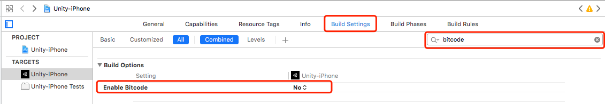

2.In the **Build Settings** of the Xcode project, search for **runpath search paths** and change its value to @**executable_path/Frameworks **, as shown in Figure:

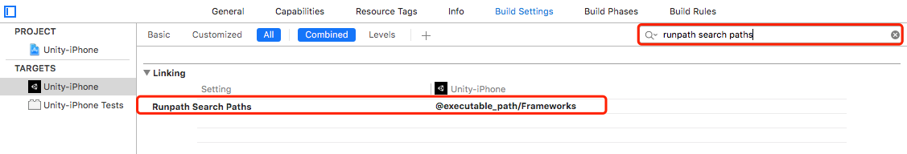

3.In the **Build Settings** of the Xcode project, search for **other linker flags** and add **-ObjC, -fobjc-arc** based on the default values, as shown in Figure:
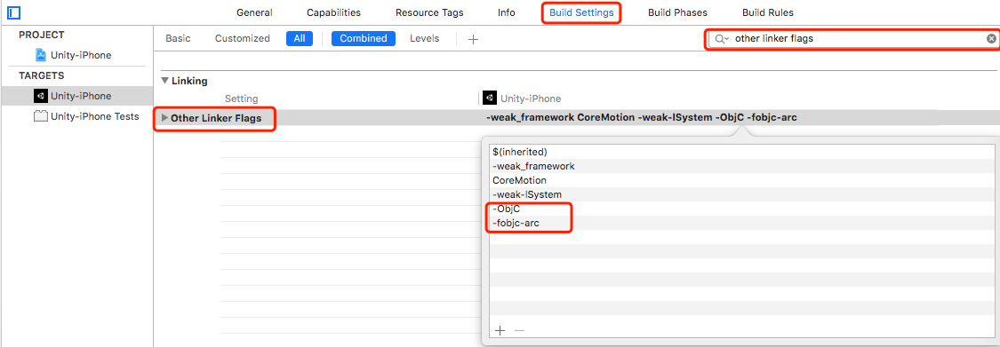

4.In the **Build Settings** of the Xcode project, search for **C Language Dialect** and change its value to** GNU99[-std=gnu99]** , as shown in Figure:

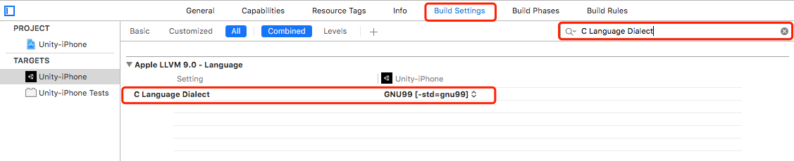

All the configurations described above can be programmatically made using the following C# **Editor Script**:

```java
#if (UNITY_5 && UNITY_IOS) || UNITY_IPHONE
using UnityEditor.iOS.Xcode;
#endif

public static class MyBuildPostprocess
{
    [PostProcessBuild(999)]
    public static void OnPostProcessBuild(BuildTarget buildTarget, string path)
    {
        #if (UNITY_5 && UNITY_IOS) || UNITY_IPHONE
            if (buildTarget == BuildTarget.iOS)
            {
                string projectPath = path + "/Unity-iPhone.xcodeproj/project.pbxproj";

                PBXProject pbxProject = new PBXProject();
                pbxProject.ReadFromFile(projectPath);

                string target = pbxProject.TargetGuidByName("Unity-iPhone");            
                pbxProject.SetBuildProperty(target, "ENABLE_BITCODE", "NO");
                pbxProject.SetBuildProperty(target, "GCC_ENABLE_OBJC_EXCEPTIONS", "YES");
                pbxProject.SetBuildProperty(target, "GCC_C_LANGUAGE_STANDARD", "gnu99");

                pbxProject.AddBuildProperty(target, "OTHER_LDFLAGS", "-ObjC");
                pbxProject.AddBuildProperty(target, "OTHER_LDFLAGS", "-fobjc-arc");
                pbxProject.AddFileToBuild(target, pbxProject.AddFile("usr/lib/libxml2.tbd", "Libraries/libxml2.tbd", PBXSourceTree.Sdk));
                pbxProject.AddFileToBuild(target, pbxProject.AddFile("usr/lib/libresolv.9.tbd", "Libraries/libresolv.9.tbd", PBXSourceTree.Sdk));
                pbxProject.WriteToFile (projectPath);

                var plistPath = Path.Combine(path, "Info.plist");
                PlistDocument plist = new PlistDocument();
                plist.ReadFromFile(plistPath);
                plist.root.SetString("GADApplicationIdentifier", "ca-app-pub-9488501426181082/7319780494");
                plist.root.SetBoolean("GADIsAdManagerApp", true);
                plist.WriteToFile(plistPath);
        }
        #endif
    }
}


```

**Note:** You have to place this segment of code into a C# file under the **Editor** directory in **Unity3D** IDE:
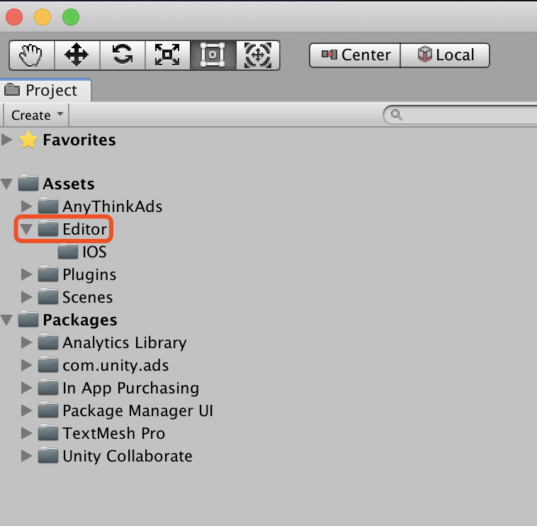

If everything goes well, your project should compile.

<h2 id='4'> 4 Initialize the SDK</h2>

You can initialize **AnyThinkSDK** with the following code segment, which is extracted from our [demo project](https://github.com/anythinkteam/demo_unity):

```java
ATSDKAPI.setChannel("unity3d_test_channel");
ATSDKAPI.initCustomMap(new Dictionary<string, string> { { "unity3d_data", "test_data" } });
ATSDKAPI.setLogDebug(true);
ATSDKAPI.initSDK("a5c4ad280995c9", "7b4e37f819dbee652ef79c4506e14288");//Use your own app_id & app_key here
```

**NOTE:** There's another init method in the ATSDKAPI class that accepts an listener object that enables you to get notified on SDK initialization completion events(succeed/fail):

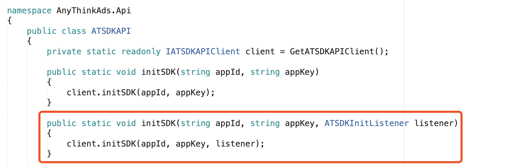

However, since subsequent operations(load, show etc.) do not depend on these events, you can use the code shown above and call the loading API immediately after you've init the SDK. 

<h2 id='5'>5. Integrate Native Ad</h2>

Before you go on, please make sure you've imported & initialized the SDK as described above.

**Note on Android：** <br>
   At present, it is not possible to use native video ads for Android APKs that are directly exported by Unity. Because Unity packaged APKs will turn off the game ’s Activity hardware acceleration by default, so videos cannot be displayed. If you need to display native advertising videos, you must use the export project method. <br><br>
As follows：<br>

**(1)Select Export Project mode to export Android project**
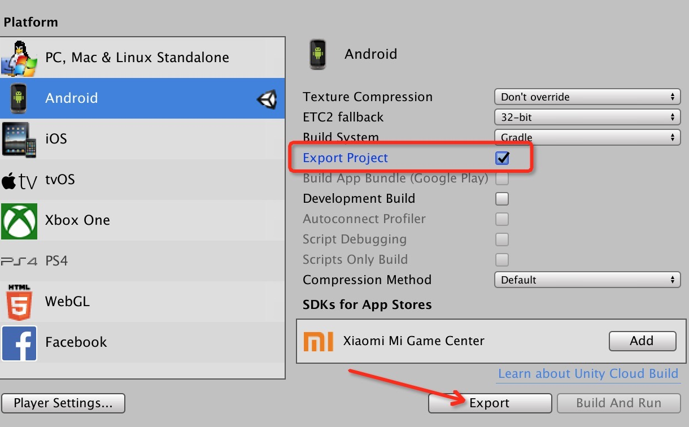

**(2)Modify the properties in AndroidManifest and set the hardwareAccelerated property in the figure to true**
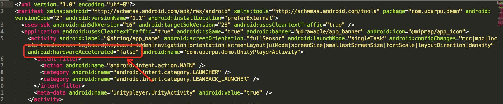


**After completing the above steps, use the current Android project to package it.。**

### 5.1 Load Native Ad 


You can load native ad using the code shown below:

```java
public void loadNative() 
{
        Debug.Log ("Developer load native, unit id = " + mPlacementId_native_all);
   
        if(callbackListener == null) {
        	callbackListener = new ATNativeCallbackListener();
            ATNativeAd.Instance.setListener(callbackListener);
        }

		Dictionary<string,string> gdtlocal = new Dictionary<string,string>();
		gdtlocal.Add ("gdtadtype","3");
		gdtlocal.Add ("gdtad_width","-1");
		gdtlocal.Add ("gdtad_height","-1");
        ATNativeAd.Instance.setLocalExtra(mPlacementId_native_all,gdtlocal);

		Dictionary<string,string> jsonmap = new Dictionary<string,string>();
		jsonmap.Add("age", "22");
		jsonmap.Add("sex", "lady");
		jsonmap.Add("native", "0");

       ATNativeAd.Instance.loadNativeAd(mPlacementId_native_all, jsonmap);
}
```
**NOTE:** Just read on to see how you can get notified on loading success/failure events.

###5.2 Show Native Ad
You can show native ad using the code shown below:

```c#
public void showNative()
{
		Debug.Log ("Developer show native....");
		ATNativeConfig conifg = new ATNativeConfig ();

		string bgcolor = "#ffffff";
		string textcolor = "#000000";
		int rootbasex = 100, rootbasey = 100;

		int x = rootbasex,y = rootbasey,width = 300*3,height = 200*3,textsize = 17;
		conifg.parentProperty = new ATNativeItemProperty(x,y,width,height,bgcolor,textcolor,textsize, true);

		//adlogo 
		x = 0*3;y = 0*3;width = 30*3;height = 20*3;textsize = 17;
		conifg.adLogoProperty  = new ATNativeItemProperty(x,y,width,height,bgcolor,textcolor,textsize, true);

		//adicon
		x = 0*3;y = 50*3-50;width = 60*3;height = 50*3;textsize = 17;
		conifg.appIconProperty  = new ATNativeItemProperty(x,y,width,height,bgcolor,textcolor,textsize, true);

		//ad cta 
		x = 0*3;y = 150*3;width = 300*3;height = 50*3;textsize = 17;
		conifg.ctaButtonProperty  = new ATNativeItemProperty(x,y,width,height,"#ff21bcab","#ffffff",textsize, true);

		//ad desc
		x = 60*3;y = 100*3;width = 240*3-20;height = 50*3-10;textsize = 10;
		conifg.descProperty  = new ATNativeItemProperty(x,y,width,height,bgcolor,"#777777",textsize, true);

		//ad image
		x = 60*3;y = 0*3+20;width = 240*3-20;height = 100*3-10;textsize = 17;
		conifg.mainImageProperty  = new ATNativeItemProperty(x,y,width,height,bgcolor,textcolor,textsize, true);

		//ad title 
		x = 0*3;y = 100*3;width = 60*3;height = 50*3;textsize = 12;
		conifg.titleProperty  = new ATNativeItemProperty(x,y,width,height,bgcolor,textcolor,textsize, true);

		ATNativeAdView anyThinkNativeAdView = new ATNativeAdView(conifg);
		AnyThinkAds.Demo.ATManager.anyThinkNativeAdView = anyThinkNativeAdView;
		Debug.Log("Developer renderAdToScene--->");
		ATNativeAd.Instance.renderAdToScene(mPlacementId_native_all, anyThinkNativeAdView);
}
```
The trailing parameter you pass to the constructor of ATNativeItemProperty class denotes whether you use pixel or not; for example, on iPhone 6, if you pass 30, 120, 300, 450 for x, y, width and height respectively, the actual value pass on to Objective-C code will be 15, 60, 150, 225 while on iPhone 7 these values will be 10, 40, 100, 150; that is, the final values will be the ones you pass devide the scale of the screen of the target device.

As you can see above, we've defined a ATNativeConfig class for you to configure the various properties(bgColor, textColor, textSize, position, etc.) for native assets like CTA button, app icon, title text, description text, cover image and so on. Please feel free to modify the properties in the config object and see what happens according to your modifications.

#### More on ATNativeConfig&ATNativeItemProperty
**ATNativeConfig**, by composing **ATNativeItemProperty** objects, gives you a way of controlling the appearance of a native ad.
**ATNativeItemProperty** controls the appearance of a single asset. Not all properties in a ATNativeItemProperty object are supported by all assets. Specifically, image assets(icon, main image etc.) supported x, y, width & height and usesPixel, while text assets(title, desc, cta etc.) support all the properties. The names of the properties of a ATNativeItemProperty are self-explanatory. Pass "clearColor" for color propieties if you want to specify clear color for iOS, for example if you want the entire ad area to have a transparent background(so your user can see throught it), specify "clearColor" for the **backgroundColor** property in **parentProperty**.

**NOTE:** 
1) "clearColor" constant is supported by iOS only, if you want to specify transparent color, use a rgba value that contains a 0 alpha: 5a2b3c00
2) colors for iOS are specified using RGB(that is, not alpha value):#5a2b3c, while for Anndroid you can pass a RGBA value like #5a2b3C00.

**parentProperty**

The parentProperty property controls the overall rect of the ad.

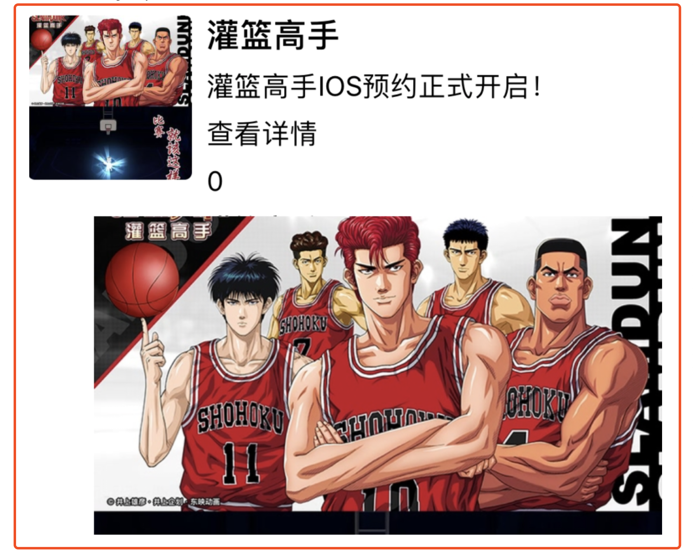

**appIconProperty**

The appIconProperty property controls the app icon of the ad, see below(the icon surrounded by a red border):
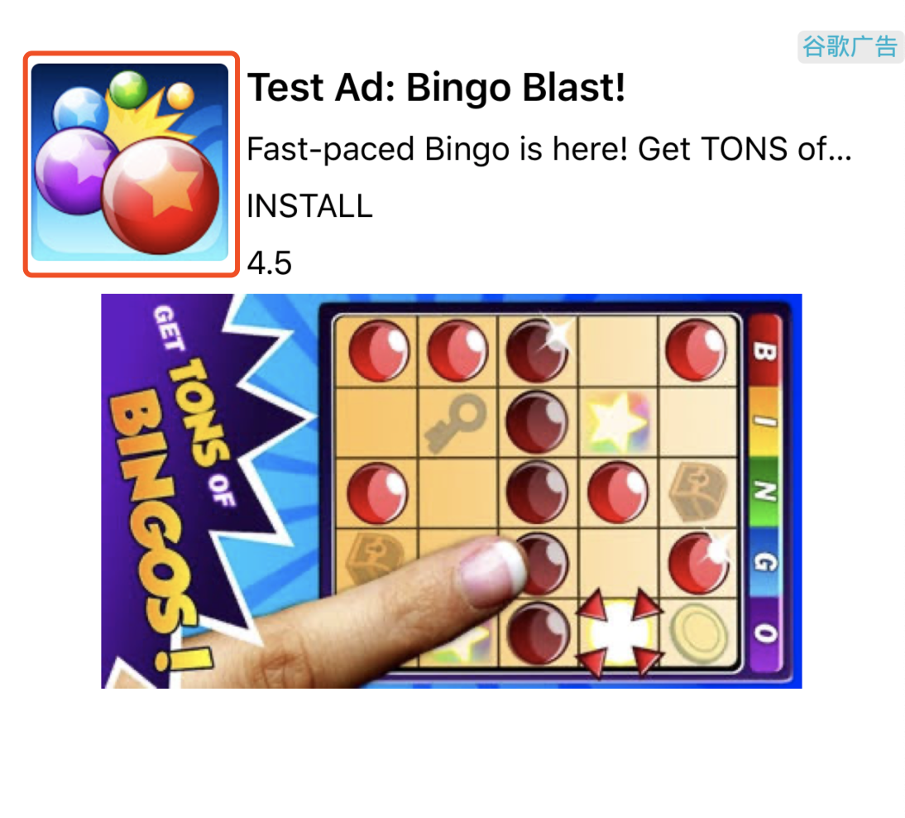

**mainImageProperty**

The mainImageProperty property controls the cover image of the ad, see below(the image surrounded by a red border):


**titleProperty**

The titleProperty property controls the title of the ad, see below(the image surrounded by a red border):
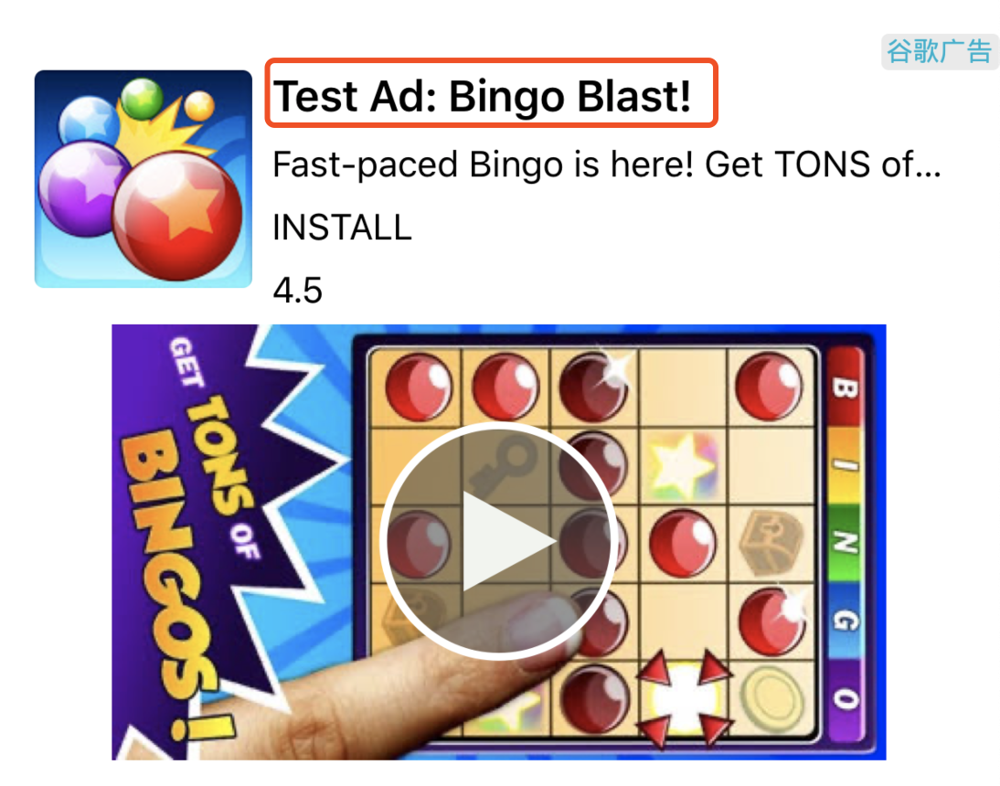

**descProperty**

The descProperty property controls the description of the ad, see below(the image surrounded by a red border):
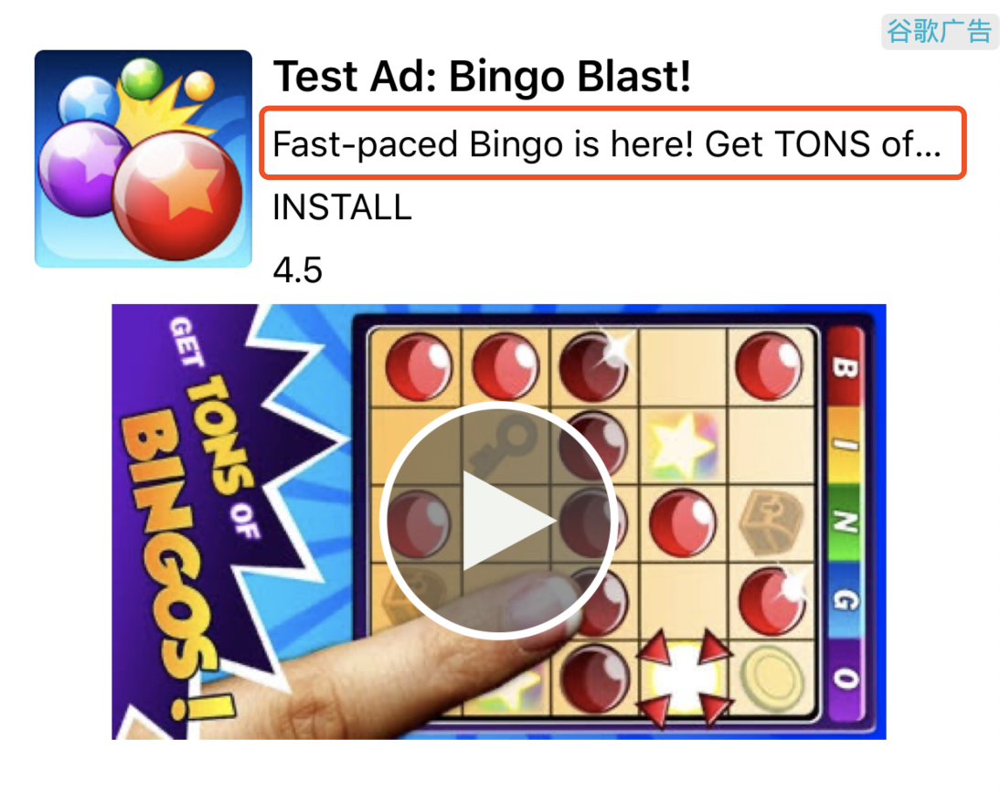

**adLogoProperty**

The adLogoProperty property controls the ad logo of the ad, see below(the image surrounded by a red border):
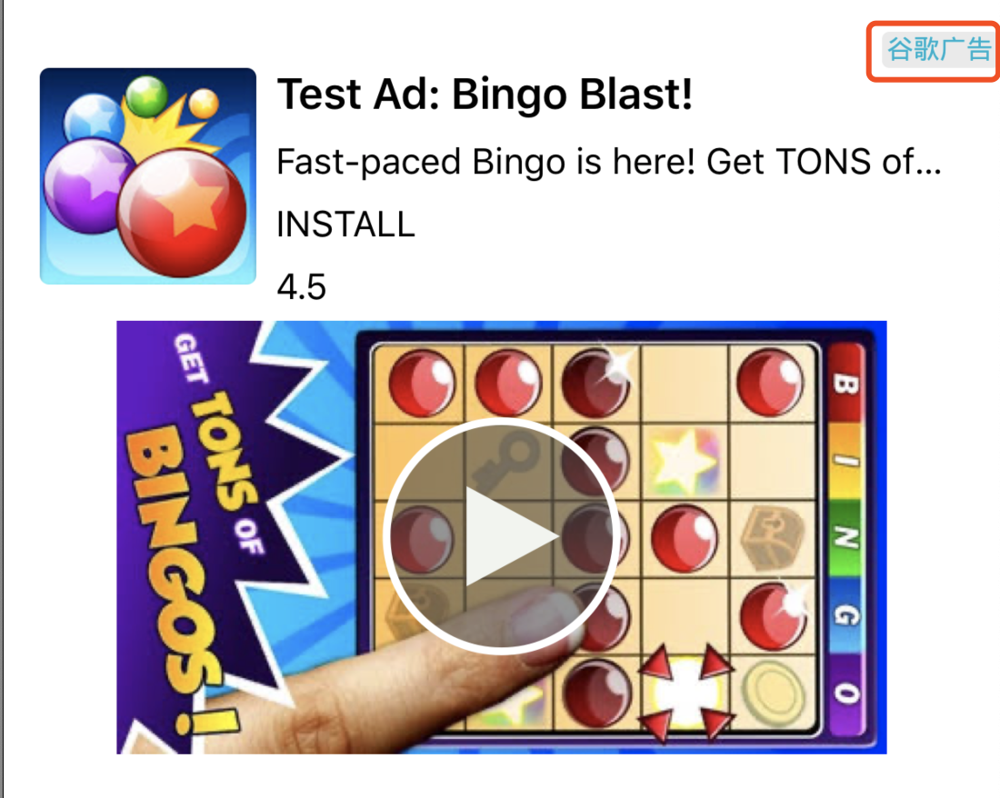

**NOTE:** Not all platforms support customized ad logo position.

**ctaButtonProperty**

The ctaButtonProperty property controls the cta of the ad, see below(the image surrounded by a red border):
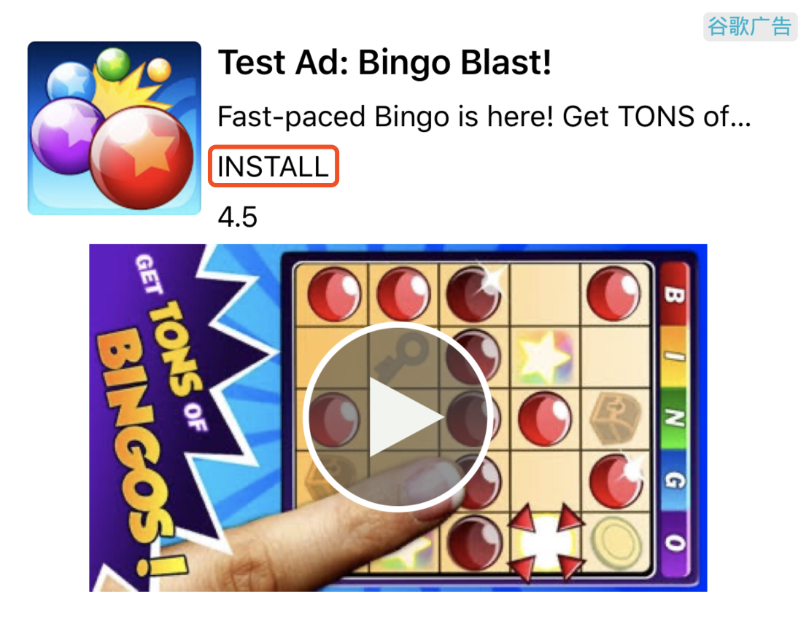


If you want to remove a native ad from the screen, use the code below:

```C#
public void cleanView()
{
	Debug.Log ("Developer cleanView native....");      
	ATNativeAd.Instance.cleanAdView(mPlacementId_native_all,AnyThinkAds.Demo.ATManager.anyThinkNativeAdView);
}
```

### 5.3 Implement Native Ad Listener

To get notified on the various native ad event(loading success/failure, impression and click, etc.), you can define a class that implements the **ATNativeAdListener** interface, here's an example:

```c#
class ATNativeCallbackListener : ATNativeAdListener
{
    public void onAdLoaded(string unitId)
    {
        Debug.Log("Developer onAdLoaded------:" + unitId);
    }
    public void onAdLoadFail(string unitId, string code, string message)
    {
        Debug.Log("Developer onAdLoadFail------:" + unitId + "--code:" + code + "--msg:" + message);
    }
    public void onAdImpressed(string unitId)
    {
        Debug.Log("Developer onAdImpressed------:" + unitId);
    }
    public void onAdClicked(string unitId)
    {
        Debug.Log("Developer onAdClicked------:" + unitId);
    }
    public void onAdVideoStart(string unitId)
    {
        Debug.Log("Developer onAdVideoStart------:" + unitId);
    }
    public void onAdVideoEnd(string unitId)
    {
        Debug.Log("Developer onAdVideoEnd------:" + unitId);
    }
    public void onAdVideoProgress(string unitId, int progress)
    {
        Debug.Log("Developer onAdVideoProgress------:" + unitId);
    }
}
```

**NOTE:** The code segments you see in this section are extracted from **nativeScene.cs** in our [demo project](https://github.com/anythinkteam/demo_unity).


<h2 id='6'>6. Integrate Rewarded Video Ad</h2>

### 6.1 Load Rewarded Video Ad
Use the code below to load rewarded video ad:<p id='loading_rv'></p>

```C#
public void loadVideo()
{
    if(callbackListener == null) {
        callbackListener = new ATCallbackListener();
        Debug.Log("Developer init video....unitid:" + mPlacementId_rewardvideo_all);
        ATRewardedVideo.Instance.setListener(callbackListener);
        ATRewardedVideo.Instance.addsetting(mPlacementId_rewardvideo_all, addsetting());
    }
   
	Dictionary<string,string> jsonmap = new Dictionary<string,string>();
	jsonmap.Add("age", "22");
	jsonmap.Add("sex", "lady");
	jsonmap.Add("rv", "1");
	
	ATRewardedVideo.Instance.loadVideoAd(mPlacementId_rewardvideo_all,jsonmap);
}
```

**Note:** See below on how to get notified on rewarded video ad events(loading sucess/failure, impression, click, video start/end and reward).

### 6.2 Show Rewarded Video Ad
Showing rewarded video is much more simple compared to showing native ad, juse call the showing api and pass a placement id as the argument:

```C#
public void showVideo()
{		
	Debug.Log ("Developer show video....");
	ATRewardedVideo.Instance.showAd(mPlacementId_rewardvideo_all);
}
```

### 6.3 Implemente Rewarded Video Ad Listener
You can get notified on rewarded video ad events by defining a class that implemente the **ATRewardedVideoListener** interface:

```C#
class ATCallbackListener : ATRewardedVideoListener {
    public void onRewardedVideoAdLoaded(string unitId){
        Debug.Log("Developer onRewardedVideoAdLoaded------");
    }

    public void onRewardedVideoAdLoadFail(string unitId, string code, string message){
        Debug.Log("Developer onRewardedVideoAdLoadFail------:code" + code + "--message:" + message);
    }

    public void onRewardedVideoAdPlayStart(string unitId){
        Debug.Log("Developer onRewardedVideoAdPlayStart------");
    }

    public void onRewardedVideoAdPlayEnd(string unitId){
        Debug.Log("Developer onRewardedVideoAdPlayEnd------");
    }

    public void onRewardedVideoAdPlayFail(string unitId, string code, string message){
        Debug.Log("Developer onRewardedVideoAdPlayFail------code:" + code + "---message:" + message);
    }

    public void onRewardedVideoAdPlayClosed(string unitId, bool isReward){
        Debug.Log("Developer onRewardedVideoAdPlayClosed------isReward:" + isReward);
    }

    public void onRewardedVideoAdPlayClicked(string unitId){
        Debug.Log("Developer onRewardVideoAdPlayClicked------");
    }

    public void onReward(string unitId){
        Debug.Log("Developer onReward------");
    }
    }
```

Create an instance of this class and pass it to the listener parameter in the loading api as shown [here](#loading_rv).

**NOTE:** The code segments in this section are extracted from **videoScenes.cs** in our [demo project](https://github.com/anythinkteam/demo_unity).

<h2 id='7'>7. Integrate Interstitial Ad</h2>

### 7.1 Load Interstitial Ad

Use the code below to load interstitial ad:

```C#
public void loadInterstitialAd() 
{
    if(callback == null) {
        callback = new InterstitalCallback();
        ATInterstitialAd.Instance.setListener(callback);
    }

    Dictionary<string,string> jsonmap = new Dictionary<string,string>();
    jsonmap.Add("age", "22");
    jsonmap.Add("sex", "lady");
    jsonmap.Add("interstitial", "3");

    ATInterstitialAd.Instance.loadInterstitialAd(mPlacementId_interstitial_all, jsonmap);
}
```
**Note:** See below on how to get notified on interstitial ad events(loading sucess/failure, impression, click, video start/end).

### 7.2 Show Interstitial Ad
Almost the same as interstitial's showing api, the interstitial showing api accepts a placement id as its sole parameter:

```C#
public void showInterstitialAd() 
{
	ATInterstitialAd.Instance.showInterstitialAd(mPlacementId_interstitial_all);
}
```

### 7.3 Implement Interstitial Listener
You can get notified on interstitial ad events by defining a class that implemente the **ATInterstitialAdListener** interface:

```C#
class InterstitalCallback : ATInterstitialAdListener
{
    public void onInterstitialAdClick(string unitId)
    {
        Debug.Log("Developer callback onInterstitialAdClick :" + unitId);
    }

    public void onInterstitialAdClose(string unitId)
    {
        Debug.Log("Developer callback onInterstitialAdClose :" + unitId);
    }

    public void onInterstitialAdEndPlayingVideo(string unitId)
    {
        Debug.Log("Developer callback onInterstitialAdEndPlayingVideo :" + unitId);
    }

    public void onInterstitialAdFailedToPlayVideo(string unitId, string code, string message)
    {
        Debug.Log("Developer callback onInterstitialAdFailedToPlayVideo :" + unitId + "--code:" + code + "--msg:" + message);
    }

    public void onInterstitialAdLoad(string unitId)
    {
        Debug.Log("Developer callback onInterstitialAdLoad :" + unitId);
    }

    public void onInterstitialAdLoadFail(string unitId, string code, string message)
    {
        Debug.Log("Developer callback onInterstitialAdLoadFail :" + unitId + "--code:" + code + "--msg:" + message);
    }

    public void onInterstitialAdShow(string unitId)
    {
        Debug.Log("Developer callback onInterstitialAdShow :" + unitId);
    }

    public void onInterstitialAdStartPlayingVideo(string unitId)
    {
        Debug.Log("Developer callback onInterstitialAdStartPlayingVideo :" + unitId);
    }

    public void onInterstitialAdFailedToShow(string unitId)
    {
        Debug.Log("Developer callback onInterstitialAdFailedToShow :" + unitId);
    }
}
```
**NOTE:** The code segments you see in this section are extracted from **interstitialScenes.cs** in our [demo project](https://github.com/anythinkteam/demo_unity).

<h2 id='8'>8. Integrate Banner Ad</h2>

### 8.1 Load Banner Ad

Use the code below to load banner ad:

```C#
public void loadBannerAd()
{
    if(bannerCallback == null) {
        bannerCallback = new BannerCallback();
        ATBannerAd.Instance.setListener(bannerCallback);
    }

    Dictionary<string, object> jsonmap = new Dictionary<string,object>();
    jsonmap.Add("age", "22");
    jsonmap.Add("sex", "lady");
    jsonmap.Add("banner", "2");
    ATSize bannerSize = new ATSize(this.screenWidth, 100, true);
    jsonmap.Add(ATBannerAdLoadingExtra.kATBannerAdLoadingExtraBannerAdSizeStruct, bannerSize);
    ATBannerAd.Instance.loadBannerAd(mPlacementId_native_all, jsonmap);
}
```
Read on to see how to get notified on banner ad events like loading success/failure, impression and click.

### 8.2 Show Banner Ad
There are two ways to show a banner ad, one is to use one of the predefined position constants, the other is to use an **ATRect** object.

#### 8.2.1 Using Predefined Position Constants
There are two predefined positions you can use to show a banner ad.

1) Show a banner on the top of the screen:

```C#
ATBannerAd.Instance.showBannerAd(mPlacementId_native_all, ATBannerAdLoadingExtra.kATBannerAdShowingPisitionTop);
```

2) Show a banner at the bottom of the screen:

```C#
ATBannerAd.Instance.showBannerAd(mPlacementId_native_all, ATBannerAdLoadingExtra.kATBannerAdShowingPisitionBottom);
```

Insets for safe area has been taken care of by AnyThinkSDK when one of these two positions is being used.

#### 8.2.2 Using an ATRect Object
```C#
public void showBannerAd() 
{
    ATRect arpuRect = new ATRect(0,70, screenWidth, 100, true);
    ATBannerAd.Instance.showBannerAd(mPlacementId_native_all, arpuRect);
}
```

The trailing parameter you pass to the constructor of ATRect class denotes whether you use pixel or not; for example, on iPhone 6, if you pass 30, 120, 300, 450 for x, y, width and height respectively, the actual value pass on to Objective-C code will be 15, 60, 150, 225 while on iPhone 7 these values will be 10, 40, 100, 150; that is, the final values will be the ones you pass devide the scale of the screen of the target device.

**Remove** a banner from the screen with the code below if you want to:

```C#
public void removeBannerAd() 
{
	ATBannerAd.Instance.cleanBannerAd(mPlacementId_native_all);
}
```

If you only want to **temporarily hide** a banner(instead of **permanently removing** it from the screen), use the code here:

```C#
public void hideBannerAd() 
{
	ATBannerAd.Instance.hideBannerAd(mPlacementId_native_all);
}
```

After you hide a banner, you can reshow it with the code below:

```C#
public void reshowBannerAd()
{
	ATBannerAd.Instance.showBannerAd(mPlacementId_native_all);
}
```

**NOTE:** Please note here that the showBannerAd method here does not accept a rect parameter, which is different from when you first show a banner. 

The difference between removing a banner and hiding a banner is that removing a banner from the screen also destroys it(meaning that before you show it again you have to load it first) while you can reshow a previously hidden banner by just calling showBannerAd method **without passing the ATRect parameter**.

## 8.3 Implement Banner Ad Listener
To get notified on the various banner ad events(loading success/failure, impression&click), just define a class that implement the **ATBannerAdListener** interface:

```C#
class BannerCallback : ATBannerAdListener
{
    public void onAdAutoRefresh(string unitId)
    {
        Debug.Log("Developer callback onAdAutoRefresh :" +  unitId);
    }

    public void onAdAutoRefreshFail(string unitId, string code, string message)
    {
        Debug.Log("Developer callback onAdAutoRefreshFail : "+ unitId + "--code:" + code + "--msg:" + message);
    }

    public void onAdClick(string unitId)
    {
        Debug.Log("Developer callback onAdClick :" + unitId);
    }

    public void onAdClose(string unitId)
    {
        Debug.Log("Developer callback onAdClose :" + unitId);
    }

    public void onAdImpress(string unitId)
    {
        Debug.Log("Developer callback onAdImpress :" + unitId);
    }

    public void onAdLoad(string unitId)
    {
        Debug.Log("Developer callback onAdLoad :" + unitId);
    }

    public void onAdLoadFail(string unitId, string code, string message)
    {
        Debug.Log("Developer callback onAdLoadFail : : " + unitId + "--code:" + code + "--msg:" + message);
    }
}
```

**NOTE:** The code segments you see in this section are extracted from **bannerScene.cs** in our [demo project](https://github.com/anythinkteam/demo_unity).

<h2 id='9'>9. On Splash Ad</h2>

It's highly recommended that splash ad should be integrated directly using native API(Objective-C/Java) in Xcode/Android Studio instead of using C# script in Unity3D. The reason for doing this is that splash ad should be loaded&shown as soon as the app finishes launching. If you integrate splash in Unity3D using C#, it can't load&show ad until Unity game engine has been launched, which happens after the app finishes launching and thus takes much more time. For more infomation on how to integrate splash using Objective-C/Java, please refer to [iOS Integration Guide](https://github.com/anythinkteam/demo_ios/blob/master/iOS_Doc_EN/iOS_Integration_Guide.md) & [Android Integration Guide](https://github.com/anythinkteam/demo_android/blob/master/en/Android_Integration_Document_For_TopOn_SDK.md).


